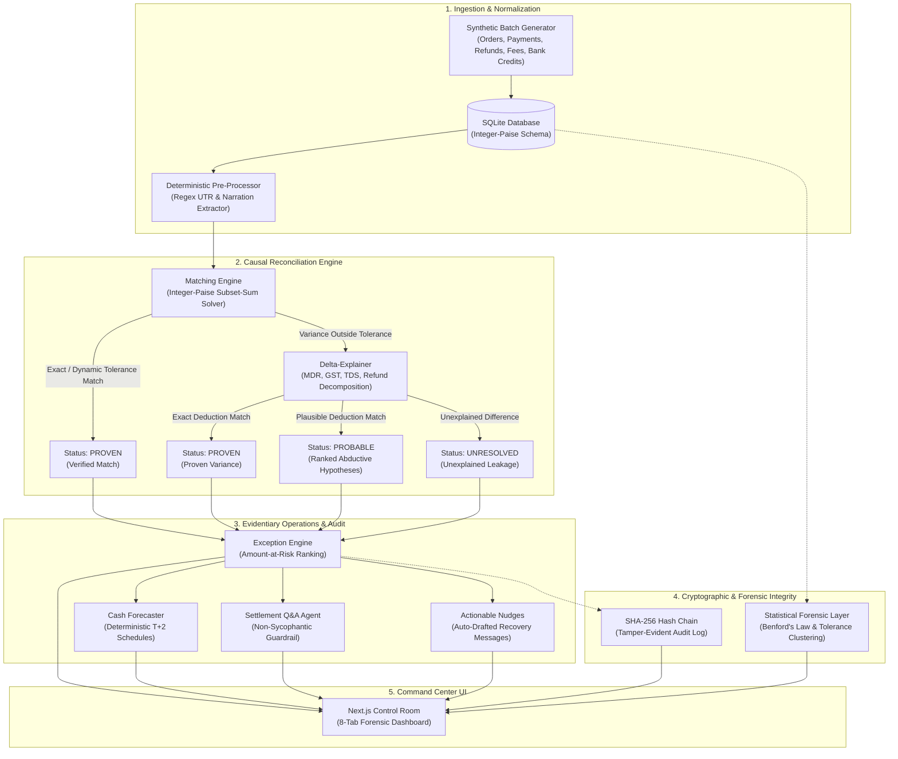

# Verity · Autonomous Financial Settlement & Forensic Controller

> **Autonomous multi-source settlement reconciliation, causal deduction explanation, and evidentiary audit engine built for Razorpay merchants.**

In payment gateway operations, settlements arrive days after transactions as aggregated lump-sum bank credits with complex, opaque deductions: Payment Gateway MDR, GST on fees, 1% Section 194O TDS, customer refunds, and dispute adjustments. Finance controllers waste days manually cross-referencing messy bank narration strings against order databases, guessing why a ₹1,27,044 gross batch resulted in a ₹1,22,331 bank credit. Traditional automation fails on multi-payment batching, while generic LLM tools hallucinate financial arithmetic. 

**Verity** solves this by enforcing a hard engineering principle: **AI should never do arithmetic, and AI should never decide what it cannot prove.** Verity couples a deterministic integer-paise subset-sum solver with causal deduction decomposition, a three-state epistemic classification system (Proven / Probable / Unresolved), a non-sycophantic Q&A agent, a cryptographic SHA-256 audit hash-chain, and a macro-population statistical forensic screening layer.

---

## What Makes Verity Different

Verity is designed around explicit engineering trade-offs, not marketing promises:

1. **Deterministic Integer-Paise Solver (Zero Arithmetic LLM Drift):**
   LLMs are strictly forbidden from performing financial math. Candidate payment combinations are matched against bank credits using an exact branch-and-bound subset-sum algorithm calculated exclusively in integer paise ($₹1.00 = 100\text{ paise}$). This completely eliminates floating-point drift and arithmetic hallucinations.

2. **Three-State Epistemic Model (No Fake Confidence Percentages):**
   Financial controllers cannot act on arbitrary probability scores (e.g. *"87% confident"*). Verity assigns every record to exactly one of three verifiable states:
   * **`PROVEN`**: Supported by an exact UTR link or a mathematically verified candidate subset sum with deduction proof.
   * **`PROBABLE`**: The gap matches a plausible statutory or commercial pattern (e.g. 1% TDS variance, refund recovery). Verity uses **abductive reasoning** to formulate ranked, falsifiable hypotheses and specifies the exact document (e.g. Form 16A TDS certificate) required to verify it.
   * **`UNRESOLVED`**: The discrepancy cannot be accounted for by any known fee schedule or deduction. Verity refuses to guess.

3. **Non-Sycophantic Settlement Q&A Agent:**
   Standard LLM assistants suffer from authority bias and sycophancy (e.g., agreeing when an executive says *"I approved this ₹150 discount"*). Verity’s Q&A agent uses an evidence-demanding guardrail: it will only confirm a reconciliation state if a concrete counterparty credit memo or ledger entry exists in `finance.db`. Verbal authority without ingested documentary evidence is explicitly rejected.

4. **Tamper-Evident SHA-256 Audit Hash-Chain:**
   Every engine verdict, state transition, and hypothesis is cryptographically linked into a sequential hash chain ($H_i = \text{SHA256}(H_{i-1} \parallel \text{CanonicalJSON}(E_i))$). Any manual modification, deletion, or backdating of records in SQLite breaks the chain and is immediately flagged by the verification engine.

5. **Statistical Forensic Layer (Macro Surveillance + Dual Caveats):**
   Verity inspects transactional populations using Benford's Law (leading 1st-digit $\chi^2$ distribution) and Tolerance Boundary Clustering ($\varepsilon$ deduction headroom). Rather than asserting false certainty, Verity ships with **honest methodological caveats**: small bounded synthetic batches naturally fail Benford's Law ($\chi^2 = 21.86$ vs critical $15.51$), and macro statistical tests can be gamed by sophisticated adversaries—meaning statistics are surveillance screens, not standalone proof of fraud.

---

## Architecture Pipeline



---

## MVP Scope

### Built in Scope
* **Deterministic Matching**: 1:1 exact matching and N:1 batch settlement matching with asymmetric dynamic tolerance envelopes.
* **Causal Delta Explanation**: Automated decomposition of discrepancies into MDR fees (2.0%), GST on MDR (18.0%), TDS withholding (1.0% Sec 194O), and customer refund recoveries.
* **Ranked Exception Docket**: Exceptions categorized as `PROBABLE` (with ranked hypotheses and required evidence) or `UNRESOLVED` (hard leakage), sorted by ₹ amount-at-risk.
* **Deterministic Forward Cash Forecaster**: Forward cash schedules calculated purely from pending unsettled payments and initiated refunds grouped by settlement offset ($T+2$).
* **Evidence-Demanding Q&A Terminal**: Adversarial-tested interactive terminal with deterministic replay fixtures and non-sycophantic guardrails.
* **Tamper-Evident Audit Log**: Sequential SHA-256 hash chaining over all state transitions with interactive live tamper simulation.
* **Actionable Nudges**: Automated drafting of context-aware counterparty recovery emails.
* **Statistical Forensics**: Pearson $\chi^2$ Benford 1st-digit analysis and 5-bin tolerance boundary clustering.

### Explicitly Out of Scope (By Design)
* **N:N Combinatorial Matching**: Real-world payment gateway settlements aggregate multiple payments into single credits (N:1); unconstrained N:N matching introduces combinatorial explosion without business relevance.
* **Predictive ML Time-Series Forecasting**: Cash forecasting sums deterministic pending ledger liabilities; statistical regression models hallucinate future revenue.
* **Live Slack/Email Dispatch**: Outbound recovery communication generates mocked drafts for human review; automated financial clawbacks require human authorization.
* **Graph Databases**: Fully normalized relational parent/child foreign keys in SQLite represent complete double-entry transaction lineage without infrastructure bloat.

---

## Tech Stack

* **Core Backend**: Python 3.10+, SQLite (Zero-float integer paise arithmetic)
* **API Layer**: FastAPI, Uvicorn, Pydantic
* **Testing & QA**: Pytest, Pytest-Mock
* **Frontend Dashboard**: Next.js 14 (App Router), TypeScript, Tailwind CSS, Lucide Icons, Framer Motion, Lenis Smooth Scroll
* **Design Language**: Modern Forensic Dark Room Theme (Amber `#d97706`, Emerald `#10b981`, Amber-Gold `#f59e0b`, Crimson `#ef4444`)

---

## How to Run

### 1. Clone & Set Up Python Environment
```bash
# Clone the repository
git clone https://github.com/darksinnnn/Verity.git
cd Verity

# Create and activate Python virtual environment
python -m venv .venv
# On Windows:
.\.venv\Scripts\activate
# On Linux/macOS:
source .venv/bin/activate

# Install Python backend dependencies
pip install fastapi uvicorn pytest requests
```

### 2. Generate Data & Run the Pipeline
Run the deterministic reconciliation pipeline sequentially to initialize the database, execute the solver, explain variances, generate forecasts, and compute forensic metrics:
```bash
# 1. Initialize SQLite database and generate synthetic transaction batch (58 payments, 54 credits)
python data_generator/generate_batch.py --size 60 --seed 42

# 2. Extract UTRs and clean narration strings
python preprocessing/preprocess_batch.py

# 3. Execute deterministic subset-sum matching solver
python matching_engine/run_matching.py

# 4. Decompose fee/tax/refund variances
python delta_explainer/run_delta_explainer.py

# 5. Build ranked exceptions docket and hypotheses
python exceptions/run_exceptions.py

# 6. Compute deterministic forward cash inflow schedules
python forecaster/run_forecaster.py

# 7. Generate actionable counterparty recovery drafts
python nudges/run_nudges.py

# 8. Compute Benford's Law and tolerance boundary clustering metrics
python forensic_layer/run_forensics.py

# 9. Compute cryptographic SHA-256 audit hash-chain
python audit_trail/run_audit.py
```

### 3. Launch Application
You can start the entire application (Backend API on `:8000` + Next.js Dashboard on `:3000`) with a single command:
```bash
# Install frontend dependencies and launch full stack
cd dashboard
npm install
cd ..
npm run dev
```

* **Dashboard URL**: `http://localhost:3000`
* **Backend API Docs**: `http://localhost:8000/docs`

---

## Running the Tests & Diagnostics

### Comprehensive Test Suite
Verity maintains **85 automated tests** across 11 test suites covering deterministic solvers, asymmetric tolerance bands, non-sycophancy guardrails, hash chain tamper detection, cash schedules, and statistical distributions:
```bash
pytest tests/ -v
```
*(All 85 tests pass in < 2.0s with zero external API dependencies).*

### Ground-Truth Accuracy Diagnostic Tool
To verify the exact matching accuracy (TP / FP / FN) against the generator's ground-truth answer key:
```bash
python matching_engine/diagnose.py
```
* **Real Solver**: `TP = 49`, `FP = 0`, `FN = 0` ($100.0\%$ Precision, $100.0\%$ Recall across clean settlement batches).
* **Naive 1:1 Matcher**: `TP = 35`, `FP = 0`, `FN = 14` (Misses all multi-payment batches).

### Adversarial Stress Testing Suite
To execute the 20 attack scenarios (19 active attacks + 1 calibration baseline) evaluating coincidental subset sums, greedy traps, boundary violations, and ghost credits:
```bash
python stress_test/run_stress_test.py
```
* **Result**: **20/20 Scenarios Defended** ($100\%$ defense rate with granular paise-level margin tracking: 19 active attack vectors + 1 zero-delta calibration baseline).

---

## API Endpoints Reference

The FastAPI backend (`api_server.py`) exposes typed REST endpoints consumed by the Next.js control room:

| Endpoint | Method | Description |
|---|---|---|
| `/api/overview` | `GET` | Headline KPI metrics (processed volume, match rate, ₹ amount at risk, status distribution) |
| `/api/reconciliation` | `GET` | Side-by-side reconciliation ledger, matched bank credits, and execution metadata |
| `/api/exceptions` | `GET` | Ranked exceptions docket (`PROBABLE` / `UNRESOLVED`) sorted by ₹ amount-at-risk |
| `/api/lineage/{credit_id}` | `GET` | Step-by-step causal deduction tape decomposing gross to net for any bank credit |
| `/api/forecast` | `GET` | Deterministic forward cash inflow schedules grouped by $T+2$ settlement date |
| `/api/qa` | `POST` | Non-sycophantic Q&A agent terminal evaluating user queries against ingested evidence |
| `/api/nudges` | `GET` | Auto-drafted context-aware counterparty recovery communication emails |
| `/api/forensics` | `GET` | Macro statistical surveillance: Benford 1st-digit $\chi^2$ & 5-bin tolerance clustering |
| `/api/audit` | `GET` | Cryptographic sequential SHA-256 audit hash-chain status and live tamper verification |

---

## Mathematical & Algorithmic Foundations

Verity enforces mathematical rigor across every module:

1. **Zero-Drift Integer-Paise Normalization:**
   $$\text{paise} = \mathrm{round}(\text{amount} \times 100)$$
   All branch-and-bound subset-sum calculations run strictly on $\mathbb{Z}_{\ge 0}$, guaranteeing zero floating-point accumulation drift.

2. **Causal Net Settlement Formula:**
   $$\text{Expected Net} = \sum \text{Gross} - \text{MDR}(2.0\%) - \text{GST on MDR}(18.0\%) - \text{TDS}(1.0\% \text{ Sec 194O}) - \sum \text{Refunds}$$
   Example: $₹100,000 - ₹2,000 - ₹360 - ₹1,000 = ₹96,640.00$.

3. **Sequential Cryptographic Audit Chaining:**
   $$H_0 = \text{SHA256}(\text{"GENESIS"})$$
   $$H_i = \text{SHA256}(H_{i-1} \parallel \text{CanonicalJSON}(E_i))$$
   Any byte-level modification of an entry $E_k$ in SQLite breaks all subsequent hashes $H_j$ ($j \ge k$).

4. **Benford's Law Chi-Square Test:**
   $$P(d) = \log_{10}\left(1 + \frac{1}{d}\right), \quad d \in \{1, \dots, 9\}$$
   $$\chi^2 = \sum_{d=1}^{9} \frac{(O_d - E_d)^2}{E_d}, \quad \text{with } \text{df} = 8, \; \chi^2_{0.05} = 15.51$$

---

## Project Structure

```
Verity/
├── api_server.py                 # FastAPI backend exposing 8 REST endpoints
├── schema.sql                    # Normalized SQLite schema with foreign key integrity
├── init_db.py                    # Database bootstrapper
├── package.json                  # Root monorepo dev orchestrator
├── data_generator/
│   └── generate_batch.py         # 50-80 record synthetic generator with ground-truth key
├── preprocessing/
│   ├── parser.py                 # Regex UTR & reference code extractor
│   └── preprocess_batch.py       # Narration sanitizer CLI
├── matching_engine/
│   ├── tolerance.py              # Asymmetric dynamic tolerance calculator
│   ├── solver.py                 # Integer-paise branch-and-bound subset-sum solver
│   ├── matcher.py                # Multi-source reconciliation orchestrator
│   ├── diagnose.py               # Ground-truth TP/FP/FN diagnostic CLI
│   └── run_matching.py           # Matching CLI runner
├── delta_explainer/
│   ├── explainer.py              # Causal MDR / GST / TDS / Refund decomposer
│   └── run_delta_explainer.py    # Delta explainer CLI runner
├── exceptions/
│   ├── engine.py                 # Epistemic classifier (Proven / Probable / Unresolved)
│   └── run_exceptions.py         # Exception ranking CLI runner
├── forecaster/
│   ├── forecaster.py             # Deterministic pending exposure forecaster
│   └── run_forecaster.py         # Cash schedule CLI runner
├── qa_agent/
│   ├── agent.py                  # Evidence-demanding non-sycophantic Q&A agent
│   └── run_qa.py                 # Interactive terminal runner
├── nudges/
│   ├── nudge_engine.py           # Context-aware communication drafter
│   └── run_nudges.py             # Nudge generator CLI runner
├── forensic_layer/
│   ├── benford.py                # Pearson Chi-Square 1st-digit Benford analyzer
│   ├── clustering.py             # Tolerance boundary clustering detector
│   ├── analyzer.py               # Read-only forensic orchestrator with dual caveats
│   └── run_forensics.py          # Forensic CLI runner
├── audit_trail/
│   ├── audit_log.py              # SHA-256 cryptographic hash-chain engine
│   └── run_audit.py              # Audit log CLI runner
├── stress_test/
│   ├── adversarial_suite.py      # 20 adversarial attack scenarios
│   └── run_stress_test.py        # Stress test CLI runner
├── tests/                        # 85 automated pytest unit & integration tests
│   ├── adversarial_transcript.json
│   ├── test_api_server.py
│   ├── test_audit_log.py
│   ├── test_delta_explainer.py
│   ├── test_exceptions.py
│   ├── test_forecaster.py
│   ├── test_forensic_layer.py
│   ├── test_matching_engine.py
│   ├── test_nudges.py
│   ├── test_preprocessing.py
│   ├── test_qa_agent.py
│   ├── test_setup.py
│   └── test_stress_test.py
└── dashboard/                    # Next.js 14 Forensic Control Room UI
    ├── app/                      # App router layout & 8-tab main page
    ├── components/               # Specialized panels (Lineage, Forensics, Audit Chain, etc.)
    ├── lib/                      # Typed API client
    └── styles/tokens.css         # Design system tokens
```

---

## Known Limitations & Methodological Disclosures

1. **Synthetic Data Benford Non-Conformity**:
   The current demo batch ($N=58$ payments, $N=54$ credits) fails Benford's Law ($\chi^2 = 21.86$ vs. Critical $\chi^2_{0.05} = 15.51$). This is a documented mathematical consequence of generating synthetic amounts from bounded uniform distributions (`randint(10000, 500000)`), not financial fraud.
2. **Local Hash-Chain Threat Model**:
   Verity’s SHA-256 hash chain prevents silent in-place modification or record deletion in `finance.db`. Defending against an attacker who recomputes the entire hash chain from genesis requires publishing daily root hashes to an external timestamping service or immutable ledger.
---
